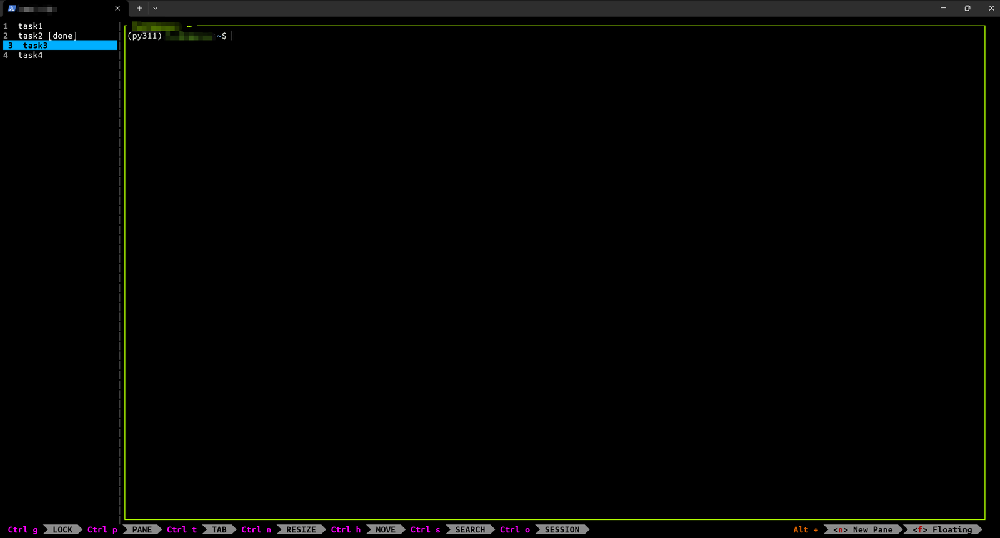

# codex-zellij-upgrade

[](https://github.com/benjohn18/codex-zellij-upgrade/actions/workflows/ci.yml)

English | [中文](#中文)

One-command Zellij setup for Codex CLI on SSH servers: vertical tabs, stable `ze` sessions, shortcuts, and the normal Zellij status bar.

```bash
git clone https://github.com/benjohn18/codex-zellij-upgrade.git
cd codex-zellij-upgrade
bash zellij_init.sh
source ~/.bashrc
ze t
```



## What You Get

- left-side vertical tabs for many Codex tasks
- `ze name`, `ze ls`, `ze kill name` for simple server-side session management
- `Alt+w/s/r/i/o` shortcuts for tab navigation, rename, and ordering
- the built-in Zellij status bar remains visible

## English

`codex-zellij-upgrade` is a one-command Zellij setup for people who run many Codex CLI sessions on a remote SSH server.

It is for users who want their Codex task list to live inside the server-side Zellij session, not across many local SSH client tabs.

It is not a new terminal multiplexer and not a replacement for Zellij. It is an opinionated installer that combines vertical tabs, stable named sessions, and simple tab shortcuts.

**Keywords:** Zellij, Codex CLI, OpenAI Codex, SSH workflow, vertical tabs, AI terminal workflow, terminal tabs, persistent sessions.

### What It Gives You

- left-side vertical tabs for many long-running tasks
- `ze name` to enter or create a stable named Zellij session
- `ze ls` and `ze kill name` for simple session management
- `Alt+w/s/r/i/o` shortcuts for tab navigation, rename, and ordering
- the built-in Zellij status bar stays enabled

This is useful when you keep many Codex panes/tabs open on a server and want the task list to live server-side instead of in local SSH client tabs.

Early versions included Codex tab-name status markers. They were removed because screen/log polling can add input latency in long-running Codex sessions. If you installed an older version, run:

```bash
bash remove_codex_status_monitor.sh
source ~/.bashrc
```

### Install

```bash
git clone https://github.com/benjohn18/codex-zellij-upgrade.git
cd codex-zellij-upgrade
bash zellij_init.sh
source ~/.bashrc
ze t
```

Restart Codex after installing:

```bash
codex
```

### Main Commands

```bash
ze name       # enter or create session "name"
ze ls         # list sessions
ze kill name  # kill/delete session "name"
```

### Shortcuts

- `Alt+w`: previous tab
- `Alt+s`: next tab
- `Alt+r`: rename current tab
- `Alt+i`: move current tab up
- `Alt+o`: move current tab down
- `Ctrl+q`: detach session
- `Ctrl+t`, then `n`: new tab

### Related Projects

- [`cfal/zellij-vertical-tabs`](https://github.com/cfal/zellij-vertical-tabs): upstream vertical tab plugin bundled here for offline install.
- [`ishefi/zellaude`](https://github.com/ishefi/zellaude): a more advanced Claude Code-aware Zellij status bar plugin.
- [`Shengfeng233/zellij-claude-enhance`](https://github.com/Shengfeng233/zellij-claude-enhance): focuses on Claude/Codex session recovery after crashes.
- [`enieuwy/showy-quota`](https://github.com/enieuwy/showy-quota): focuses on AI quota/status strips for Zellij, tmux, and SketchyBar.

`codex-zellij-upgrade` is intentionally smaller: a practical installer for Codex + Zellij + SSH workflows.

### Files

- `zellij_init.sh`: one-command installer
- `remove_codex_status_monitor.sh`: remove old Codex status monitor from earlier installs
- `zellij-vertical-tabs.wasm`: bundled vertical tab plugin
- `user_readme.md`: short user cheat sheet
- `SUPPORT.md`: restore and debugging notes

### License

MIT. The bundled `zellij-vertical-tabs.wasm` comes from the MIT-licensed `cfal/zellij-vertical-tabs` project. See `THIRD_PARTY_NOTICES.md`.

---

## 中文

`codex-zellij-upgrade` 是一个给远程 SSH 服务器上的 Codex CLI 工作流用的 Zellij 一键配置脚本。

它适合希望把 Codex 任务列表放在服务器端 Zellij session 里，而不是散落在本地 SSH 客户端多个 tab 里的人。

它不是新的终端复用器，也不是要替代 Zellij。它是一个偏实用的安装器：把竖向 tab、固定名字 session、简单快捷键组合到一起。

**关键词：** Zellij、Codex CLI、OpenAI Codex、SSH 工作流、竖向 tab、AI 终端工作流、终端 tab、持久 session。

### 它解决什么

- 左侧常驻竖向 tab，适合很多长期任务
- `ze name` 进入或创建固定名字的 Zellij session
- `ze ls` 和 `ze kill name` 简化 session 管理
- `Alt+w/s/r/i/o` 用来切换、改名、移动 tab
- 保留 Zellij 内置状态栏

适合你在服务器上开很多 Codex tab，希望任务列表留在服务器端，而不是散落在本地 SSH 客户端窗口里。

早期版本带 Codex tab 状态标记。这个功能会轮询屏幕和日志，长时间 Codex 会话里可能导致输入延迟，所以现在已经移除。旧用户可以运行：

```bash
bash remove_codex_status_monitor.sh
source ~/.bashrc
```

### 安装

```bash
git clone https://github.com/benjohn18/codex-zellij-upgrade.git
cd codex-zellij-upgrade
bash zellij_init.sh
source ~/.bashrc
ze t
```

安装后需要重新启动 Codex：

```bash
codex
```

### 主要命令

```bash
ze name       # 进入或创建 name 这个 session
ze ls         # 查看所有 session
ze kill name  # 删除 name 这个 session
```

### 快捷键

- `Alt+w`: 上一个 tab
- `Alt+s`: 下一个 tab
- `Alt+r`: 改当前 tab 名字
- `Alt+i`: 当前 tab 往上移动
- `Alt+o`: 当前 tab 往下移动
- `Ctrl+q`: 挂起 / detach 当前 session
- `Ctrl+t` 后按 `n`: 新建 tab

### 相关项目

- [`cfal/zellij-vertical-tabs`](https://github.com/cfal/zellij-vertical-tabs)：本项目内置的竖向 tab 插件来源。
- [`ishefi/zellaude`](https://github.com/ishefi/zellaude)：更高级的 Claude Code-aware Zellij 状态栏插件。
- [`Shengfeng233/zellij-claude-enhance`](https://github.com/Shengfeng233/zellij-claude-enhance)：重点是 Claude/Codex 崩溃后的 session 恢复。
- [`enieuwy/showy-quota`](https://github.com/enieuwy/showy-quota)：重点是 AI quota/status strip。

`codex-zellij-upgrade` 的定位更小：给 Codex + Zellij + SSH 工作流提供一个直接能用的一键安装配置。

### 文件

- `zellij_init.sh`: 一键安装脚本
- `remove_codex_status_monitor.sh`: 清理旧版 Codex 状态监控
- `zellij-vertical-tabs.wasm`: 内置竖向 tab 插件
- `user_readme.md`: 给普通用户看的简短说明
- `SUPPORT.md`: 恢复和调试说明

### 开源协议

MIT。内置的 `zellij-vertical-tabs.wasm` 来自 MIT 协议的 `cfal/zellij-vertical-tabs` 项目，见 `THIRD_PARTY_NOTICES.md`。
